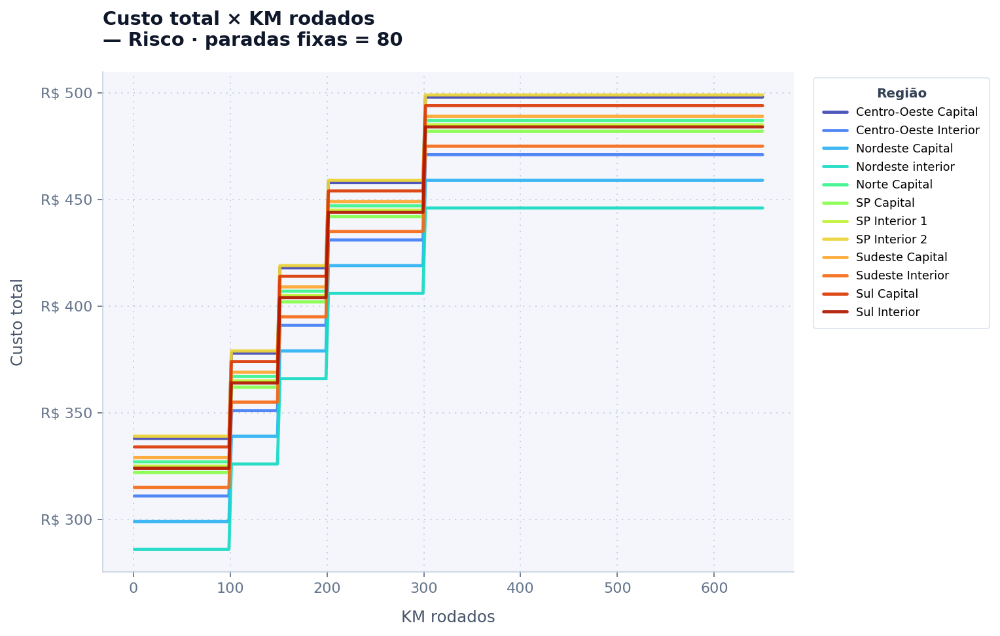
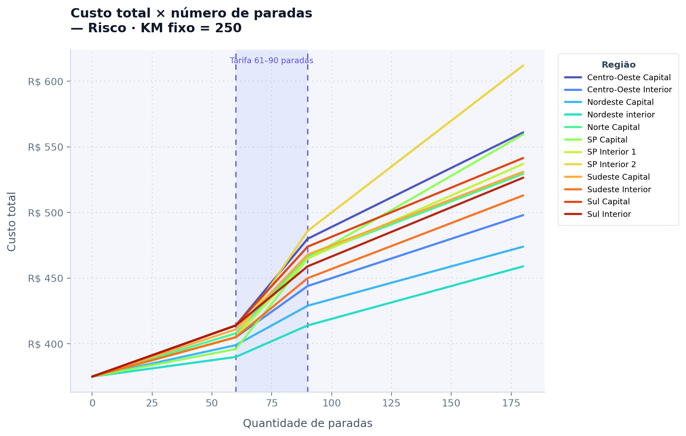

# Cálculo de custo logístico (Excel)

Modelo em Excel que calcula **automaticamente o custo total** de uma operação logística a partir de **Região**, **tipo de veículo**, **quilometragem rodada** e **quantidade de paradas**. A pasta de trabalho **final**, com a tabela cruzada materializada e pronta para uso, é **`Exercicio recrutamento Finalizado.xlsx`**. O ficheiro **`Exercicio recrutamento.xlsx`** é apenas uma versão intermédia e não deve ser usado como referência da tabela tratada.

**Documentação principal:** a explicação do negócio, da montagem no Excel, das figuras e da leitura dos gráficos está **neste README**. **Baixar ou clonar o repositório e abrir os ficheiros no VS Code** (ou noutro editor) é **opcional**: só faz sentido se quiser **ver o código por detrás** dos gráficos feitos em Python (`logistics_visualization.ipynb`) — não é requisito para entender o case tal como está descrito aqui.

---

## Contexto da demanda

A entrada era uma base de **operações logísticas** com:

- **MacroRegião** e **Região** (zona por onde o motorista passa)
- **Veículo**
- **Km rodados**
- **Custo fixo** por faixa de km e tipo de veículo
- **Custo variável por paradas**, dependente da **Região**:
  - faixa **0–60** paradas → valor por parada
  - faixa **61–90** → outro valor por parada
  - **91+** → outro valor por parada

**Objetivo:** obter o **custo final** sem cálculo manual, usando só Região, veículo, km e paradas.

Os dados vinham em **três abas** no mesmo estilo visual (uma para **Sudeste**, outra para **Centro-Oeste e Sul**, outra para **Norte e Nordeste**), em formato **wide**: poucas linhas, muitas colunas, com **dois níveis de cabeçalho** (macro região englobando região; faixas de paradas dentro de cada região; faixas de km nas linhas; colunas de veículos para custo fixo).

---

## Abordagem adotada

A estrutura wide concentra informação em poucas linhas, mas dificulta **busca automática** e **regras claras por linha**. A solução foi **normalizar** para um formato **long**: **mais linhas**, **menos colunas**, cada linha representando uma combinação consultável (região × faixa de km × veículo × tarifas de parada).

Para não perder rastreabilidade, o trabalho foi dividido em **tabelas auxiliares** por blocos de informação correlata (valores únicos onde faz sentido), depois **integradas** para gerar todas as combinações necessárias.

### Tabela auxiliar — km e veículos (custo fixo)

- Faixa de km como **`KmMin`** e **`KmMax`** (uma linha por faixa).
- Custos fixos por tipo de veículo naquela faixa (na origem wide isso aparecia como várias colunas de veículos).
- O custo fixo por km/veículo era **o mesmo para todas as regiões**; por isso bastou espelhar a lógica da tabela de referência sem duplicar por macro região.

### Tabela auxiliar — paradas e região (custo variável)

- **MacroRegião**, **Região** e três colunas de tarifa (**0–60**, **61–90**, **91+**), com os valores por região.

### Power Query

A partir dessas duas auxiliares foram criadas duas consultas de referência:

1. **`Km/Veículos`**
   - Ajustes de nomes e tipos.
   - **Unpivot** nas colunas de tipos de veículo: cada tipo vira linha; os valores viram a coluna **custo fixo** (wide → long para km × veículo × custo fixo).
   - Coluna **`Chave`** com valor **1** para permitir **cross join** com a tabela de paradas/região.
   - **20 linhas** após o processamento.

2. **`Paradas/Região`**
   - Ajustes pontuais de tipagem e nomes.
   - Mesma coluna **`Chave = 1`** para o merge.
   - **12 linhas**.

### Tabela final (`Tabela Final` ou `Tabela_Final`)

- **Merge** (**left outer join**) entre **`Km/Veículos`** e **`Paradas/Região`** pela **`Chave`**, mantendo todas as linhas da dimensão km/veículo e **expandindo** todas as combinações com região e tarifas de parada.
- Resultado: tabela **long** com todas as ocorrências necessárias para lookup (incluindo macro região, região, faixa de km, veículo, custo fixo e três tarifas de parada).
- Colunas **reordenadas** para leitura mais clara.

---

## Aba de uso (`Exercício`)

- Entrada: **Região**, **Veículo**, **Km**, **Paradas**.
- **Valor final** calculado por fórmulas que consultam a **tabela cruzada final** (nome da aba costuma ser **`Tabela Final`** ou **`Tabela_Final`**) — custo fixo conforme faixa de km e veículo; custo variável conforme blocos de paradas e tarifas da região.

### Integridade da entrada

- **Lista suspensa** para Região e Veículo (aba **`Lista`** — oculta por padrão — com ocorrências válidas + **validação de dados**).
- Para campos numéricos: validação como **número** em faixa **1–9999** (ajustável se precisar de limite maior).

### Conferência do resultado

- Duas colunas com o **decomposição** do total (**custo fixo** e **custo variável**), **ocultas por padrão**, para auditoria quando necessário.

### Formatação

- Dados da aba de exercício como **Tabela do Excel**: novas linhas herdam validação e formatação.

### Abas ocultas

Para deixar o arquivo mais limpo na revisão, as seguintes abas ficam **ocultas** por padrão (continuam no arquivo para rastreio dos dados e do modelo):

- **Originais regionais:** **Sudeste**, **Sul e Centro-Oeste**, **Norte e Nordeste** (fontes wide dos valores)
- **Tabelas auxiliares** usadas antes da consolidação no Power Query
- **`Lista`** (ocorrências de Região e Veículo para validação / lista suspensa)

Para ver de novo: clique com o botão direito em qualquer nome de aba → **Mostrar / Unhide** e escolha a planilha desejada.

---

## Visualização em Python (notebook)

O arquivo **`logistics_visualization.ipynb`** lê **`Exercicio recrutamento Finalizado.xlsx`**, localiza automaticamente a aba da tabela final (**`Tabela Final`** ou **`Tabela_Final`**), replica a **mesma lógica de custo fixo + variável por faixas de paradas** e gera gráficos interativos no Jupyter:

1. **Custo total × KM** — **um único painel** para o veículo em `VEICULO_PADRAO` (definido na primeira célula, por defeito o primeiro da lista `veiculos`); **uma linha por região**; **paradas fixas** (editável na célula).
2. **Custo total × paradas** — **um único painel** para o mesmo veículo; **uma linha por região**; **KM fixo = 250** (editável na célula). Linhas tracejadas marcam os cortes 60 e 90 paradas.

Os plots também são salvos em `figures/` como `nb_km_por_veiculo_linhas_regiao.png` e `nb_paradas_por_veiculo_linhas_regiao.png`.

### Figuras exportadas — o que isso vende para o negócio

Os gráficos vêm do notebook no **cenário padrão** (primeiro veículo da lista — **Risco** —, **80 paradas** no gráfico de km e **250 km** no de paradas; dá para mudar na primeira célula). A ideia não é “bonito demais”: é **enxergar onde o dinheiro escapa** quando você **estica rota** ou **empilha parada**.

#### Gráfico de km — onde aparece o salto



Com **paradas travadas**, o gráfico não é uma retinha subindo: é uma **escada**. **Dentro da mesma faixa de km**, rodar mais **quase não mexe no total** (por isso aparecem trechos “chatos”). O barulho está nos **limites entre faixas**: quando o km **passa para o patamar seguinte**, o **custo fixo** recalcula e o total **dá um pulo**.

No arquivo que este case usa, para o **Risco** esse tipo de salto entre faixas está na casa de **dezenas de reais por degrau** (ordem de **~40 R$** entre uma banda e outra nos pontos de virada; outros tipos de veículo chegam a **saltos um pouco maiores** no mesmo modelo). Traduzindo para decisão: **não é cada km extra que dói — é cruzar o limite da faixa.** Planejamento de rota e bidding ganham muito quando você sabe **quantos “degraus”** uma operação atravessa.

Sobre as **linhas por região**: mesmo km, mesmo veículo, **altura diferente**. Isso não é bug — é o **custo variável das paradas** (aqui fixo em 80) mudando conforme **onde** você opera. Ou seja: dá para comparar **“quanto EU pago a mais ou a menos”** só pela região, antes mesmo de discutir km.

#### Gráfico de paradas — onde a conta acelera



Com **km fixo**, o custo fixo **não oscila** — quem manda é **parada**. A curva sobe o tempo todo, mas **a inclinação muda** quando você entra no **61–90** e de novo no **91+**: são **preços por parada diferentes** em cada bloco. Na prática, **operar “pesado” em paradas** significa que você pode estar pagando **bem mais por cada nova parada** do que no começo da curva.

Destaque honesto do modelo: na **faixa do meio (61–90)** a tarifa por parada costuma ser **a mais agressiva** nas regiões caras — por exemplo **SP Interior 2** aparece com valor unitário **bem maior** nesse bloco do que no bloco inicial (0–60). É exatamente por isso que o gráfico **marca essa faixa**: é onde muita gente **descobre tarde** que “mais algumas paradas” viraram **outro preço por parada**.

Comparar regiões aqui é onde o negócio grita. Pegando o **mesmo** cenário do notebook (**250 km**, veículo **Risco**, ir de **0 para 180 paradas**), a **parcela extra só por paradas** vai de algo como **~84 R$** no cenário mais barato (**Nordeste interior**) até **~237 R$** no mais caro (**SP Interior 2**) — **mesma intensidade operacional, custo variável quase três vezes maior** só pela combinação região × tarifas. Quem negocia SLA, roteiriza última milha ou monta tabela de frete **precisa enxergar esse gap**, não só o número final.

#### Sweet spot com o veículo padrão (Risco): mais km, menos dinheiro

Neste workbook o **Risco** usa faixas de km **`1–100`**, **`101–150`**, **`151–200`**, **`201–300`** e **`301+`** (até o teto do modelo). O “pulo” de custo só acontece quando **entras na faixa seguinte** — por isso o melhor negócio em **quilometragem por real gasto em custo fixo** é **usar o fim da faixa**: quanto mais próximo estiver do **teto** (**100, 150, 200, 300 km…**) **sem o atravessar**, mais km você **embute no mesmo patamar** de fixo. Passar o limite só vale a pena quando a operação **realmente precisa** daqueles km a mais.

Do lado das **paradas**, o melhor custo vem de **trabalhar com o menor número possível** e, quando der, **não sair do bloco 0–60**: acima disso o modelo cobra **mais por parada** na maior parte das regiões — e o intervalo **61–90** é onde isso costuma **doer mais**.

Depois de **300 km** já estás na última faixa de fixo do ficheiro: **não há novo degrau de custo fixo** por km — o foco passa a ser **paradas** e **região** (onde a variável mais pesa).

**Resumo:** km te castiga em **pulos** nas fronteiras de faixa; paradas te castigam em **ritmo** — e o **61–90** costuma ser o lugar onde o modelo mais **aperta por parada**. Use o GitHub se quiser reproduzir os números com outros veículos ou constantes.

| Arquivo | Conteúdo |
|---------|----------|
| `logistics_visualization.ipynb` | Notebook com dados, funções e os dois conjuntos de gráficos. |
| `requirements.txt` | `pandas`, `openpyxl`, `matplotlib`, `jupyter`, `ipykernel`. |

Os comandos abaixo são para **ambiente local**; só precisa deles se for **correr ou alterar o notebook** no VS Code ou na linha de comandos.

```bash
pip install -r requirements.txt
jupyter notebook logistics_visualization.ipynb
```

---

## Observação técnica (ambiente)

As fórmulas foram montadas com **nomes de função em inglês** e separador **`;`** entre argumentos (configuração usual em conjunto com locale que usa vírgula decimal). Em Excel atual (Microsoft 365 / Office recente), o arquivo costuma abrir e recalcular normalmente em outras máquinas.

---

## Repositório

| Item | Descrição |
|------|-----------|
| `Exercicio recrutamento Finalizado.xlsx` | **Versão final:** tabela cruzada na aba `Tabela_Final` / `Tabela Final`, aba `Exercício`, auxiliares e originais regionais — é este ficheiro que o notebook e as análises devem ler. |
| `Exercicio recrutamento.xlsx` | Versão intermédia (rascunho); não usar como fonte da tabela finalizada. |
| `logistics_visualization.ipynb` | Notebook: gráficos custo × KM e custo × paradas (um painel por gráfico, um veículo em `VEICULO_PADRAO`; linhas = regiões). |
| `requirements.txt` | Dependências Python + Jupyter. |
| `figures/*.png` | Exportações do notebook (e imagens antigas, se existirem). |

Este README descreve **o que foi implementado** e **como o arquivo está organizado**, para quem for revisar o case ou reutilizar o modelo. Quem seguir só esta página já tem a história completa; o código no repositório é um extra para curiosos ou para replicação técnica.
